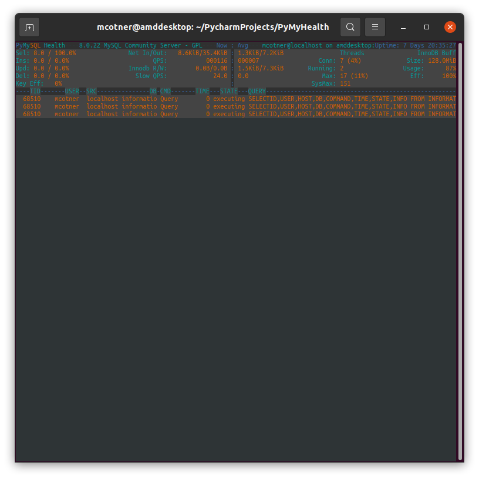

# PyMyHealth
PyMyHealth is top for MySQL

# Should be considered alpha level software.  Not yet for public consumption.

AsciiUI.py is a simple UI created with asciimatics so in theory it should be multi-platform.  Currently only tested on Linux.

PyMyHealth.py is a utility for gathering intelligence from a MySQL database.

Has been tested on MariaDB and MySQL community 8.0.22.  Much more testing is needed.  
The goal is to support 5.7+.  No support for 5.6 will be added, 
but it may work with the proper sys tables and performance_schema added.

